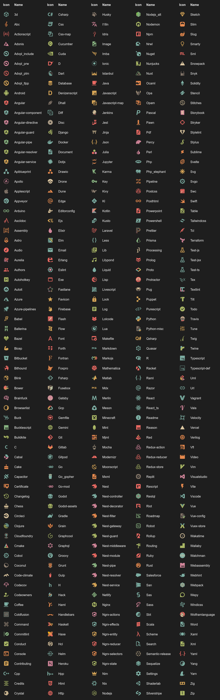
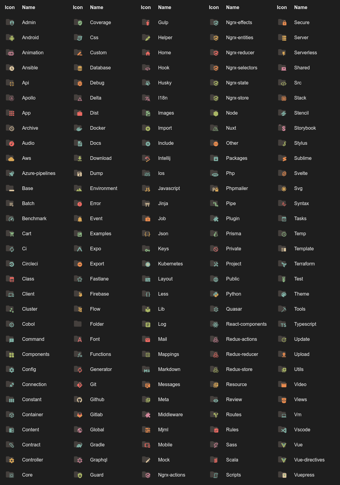

<h1 align="center">
   
    
    
  Icons
   
   
</h1>

<h4 align="center">Get the Icons into your VS Code.</h4>

    &nbsp;
    &nbsp;
    &nbsp;
    

## File icons

### Folder icons

## Installation

1. Open the extensions sidebar on Visual Studio Code
1. Search for **icons**
1. Click Install
1. Click Reload to reload your editor
1. Select the Manage Cog (bottom left) > File Icon Theme ＞ **Icons**
1. 🌟🌟🌟🌟🌟 Rate five-stars 😃

## How to use

After installation and activation, you should go in settings (`File` → `Preferences` on Windows, or `Code` → `Preferences` on OSX), choose `File Icon Theme`, and select `Icons`.

## Want more?

I can add more icons if you need, [open a **new** issue](https://github.com/tal7aouy/vscode-icons/issues) to ask which extension you want.

## Changelog

[See full changelog here](https://github.com/tal7aouy/vscode-icons/blob/master/CHANGELOG.md)

## Icon sources

- [Material Design Icons](https://materialdesignicons.com/)
- official icons

### Contributors

This project exists thanks to all the people who contribute.

